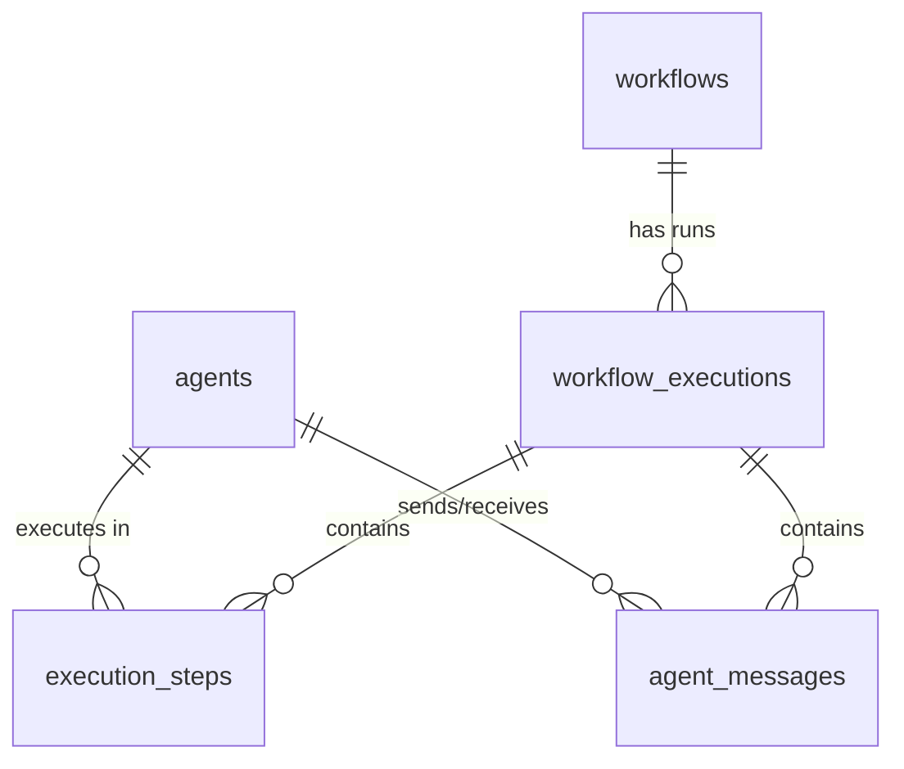

# Yuno AI Agent Orchestration Platform — Implementation Spec

> **Purpose**: This document is the complete implementation blueprint for Claude Code. It covers architecture, database schema, API contracts, orchestration logic, UI structure, workflow templates, and testing strategy. Build exactly what's described here.

> **Context**: This is a hiring partner project for **Yuno**, a payment orchestration fintech company (a16z-backed). They build infrastructure that routes payments through multiple providers. Their engineering culture values clean architecture, reliability, real-time systems, and orchestration patterns. This project should reflect that sensibility — think of agent workflows the way Yuno thinks of payment flows: configurable, observable, reliable, and recoverable.

---

## 1. Architecture Overview

```
┌─────────────────────────────────────────────────────────────────┐
│                        BROWSER (User)                           │
│                                                                 │
│   React (Vite) + Tailwind + shadcn/ui + React Flow             │
│   - Agent CRUD UI                                               │
│   - Visual Workflow Builder (node graph)                        │
│   - Live Monitoring Dashboard                                   │
│   - Execution History & Message Trail Viewer                    │
│                                                                 │
│   Connects to backend via:                                      │
│     REST  → http://VPS_IP:8000/api/v1/...                       │
│     WS    → ws://VPS_IP:8000/ws/monitor                         │
└──────────────────────┬──────────────────────────────────────────┘
                       │
                       │ HTTP REST + WebSocket
                       ▼
┌─────────────────────────────────────────────────────────────────┐
│                   BACKEND (FastAPI + Python)                     │
│                   Port 8000                                     │
│                                                                 │
│   ┌──────────────┐  ┌──────────────┐  ┌──────────────────────┐  │
│   │  REST API    │  │  WS Manager  │  │  Orchestration       │  │
│   │  (CRUD,      │  │  (push live  │  │  Engine              │  │
│   │   triggers)  │  │   events to  │  │  (workflow executor,  │  │
│   │              │  │   frontend)  │  │   agent-to-agent     │  │
│   │              │  │              │  │   message routing,   │  │
│   │              │  │              │  │   condition eval,    │  │
│   │              │  │              │  │   retry/loop logic)  │  │
│   └──────────────┘  └──────────────┘  └──────────────────────┘  │
│                                                                 │
│   Connects to:                                                  │
│     Postgres    → postgresql://localhost:5432/agentplatform      │
│     OpenClaw GW → ws://localhost:18789 (Gateway WebSocket RPC)  │
│                                                                 │
└──────────┬──────────────────┬───────────────────────────────────┘
           │                  │
           ▼                  ▼
┌──────────────────┐  ┌──────────────────────────────────────────┐
│   PostgreSQL     │  │          OpenClaw Gateway                 │
│   Port 5432      │  │          Port 18789                      │
│                  │  │                                          │
│   Tables:        │  │   - Agent runtime (LLM loop)            │
│   - agents       │  │   - Session management                  │
│   - workflows    │  │   - Tool execution (shell, browser, fs) │
│   - workflow_    │  │   - Skill system (SKILL.md)             │
│     executions   │  │   - Memory (MEMORY.md)                  │
│   - execution_   │  │   - Cron/Heartbeat scheduler            │
│     steps        │  │   - Channel adapters:                   │
│   - agent_       │  │       Telegram ◄──► Telegram Bot API    │
│     messages     │  │       WebChat (built-in)                │
│                  │  │   - WebSocket RPC protocol:             │
│                  │  │       chat.send, chat.history,           │
│                  │  │       sessions.list, config.patch,       │
│                  │  │       cron.*, skills.*, etc.             │
│                  │  │                                          │
└──────────────────┘  └──────────────────────────────────────────┘
```

### Communication Protocols

| From → To | Protocol | Purpose |
|---|---|---|
| Frontend → Backend | REST (HTTP) | CRUD operations, trigger workflow runs |
| Frontend → Backend | WebSocket | Real-time monitoring (agent status, logs, messages) |
| Backend → Postgres | SQLAlchemy async | Persist workflows, executions, messages |
| Backend → OpenClaw | WebSocket (RPC) | Send messages to agents, read sessions, manage config |
| OpenClaw → Telegram | Telegram Bot API (long-polling) | External human-agent chat |
| OpenClaw → LLM | HTTPS | Model inference (Anthropic/OpenAI API) |

### Docker Compose Layout

```yaml
services:
  openclaw:
    image: ghcr.io/openclaw/openclaw:latest
    container_name: openclaw-gateway
    restart: unless-stopped
    ports:
      - "18789:18789"
    volumes:
      - ./openclaw-data/config:/root/.openclaw
      - ./openclaw-data/workspace:/root/workspace
    env_file:
      - .env
    healthcheck:
      test: ["CMD", "curl", "-f", "http://localhost:18789/health"]
      interval: 10s
      timeout: 5s
      retries: 5

  postgres:
    image: postgres:16-alpine
    container_name: platform-db
    restart: unless-stopped
    ports:
      - "5432:5432"
    environment:
      POSTGRES_DB: agentplatform
      POSTGRES_USER: platform
      POSTGRES_PASSWORD: ${POSTGRES_PASSWORD:-devpassword}
    volumes:
      - pgdata:/var/lib/postgresql/data
    healthcheck:
      test: ["CMD-SHELL", "pg_isready -U platform -d agentplatform"]
      interval: 5s
      timeout: 3s
      retries: 5

  backend:
    build:
      context: ./backend
      dockerfile: Dockerfile
    container_name: platform-backend
    restart: unless-stopped
    ports:
      - "8000:8000"
    environment:
      DATABASE_URL: postgresql+asyncpg://platform:${POSTGRES_PASSWORD:-devpassword}@postgres:5432/agentplatform
      OPENCLAW_WS_URL: ws://openclaw:18789
      OPENCLAW_AUTH_TOKEN: ${OPENCLAW_AUTH_TOKEN}
    depends_on:
      postgres:
        condition: service_healthy
      openclaw:
        condition: service_healthy

  frontend:
    build:
      context: ./frontend
      dockerfile: Dockerfile
    container_name: platform-frontend
    restart: unless-stopped
    ports:
      - "3000:3000"
    environment:
      VITE_API_URL: http://${HOST_IP:-localhost}:8000
      VITE_WS_URL: ws://${HOST_IP:-localhost}:8000
    depends_on:
      - backend

volumes:
  pgdata:
```

### Single Setup Command

```bash
# setup.sh — the "one command" entry point
#!/bin/bash
set -e

echo "=== Yuno Agent Orchestration Platform Setup ==="

# Check prerequisites
command -v docker >/dev/null 2>&1 || { echo "Docker required. Install: https://docs.docker.com/get-docker/"; exit 1; }
command -v docker compose >/dev/null 2>&1 || { echo "Docker Compose v2 required."; exit 1; }

# Create .env if missing
if [ ! -f .env ]; then
  cp .env.example .env
  echo "Created .env from template. Edit it with your API keys, then re-run this script."
  exit 0
fi

# Build and launch
docker compose up -d --build

echo ""
echo "Platform is starting..."
echo "  Frontend:  http://localhost:3000"
echo "  Backend:   http://localhost:8000/docs"
echo "  OpenClaw:  http://localhost:18789"
echo ""
echo "Run 'docker compose logs -f' to watch startup."
```

---

## 2. Database Schema

Use **SQLAlchemy 2.0** with async engine (`asyncpg`). Use **Alembic** for migrations.

### Table: `agents`

Stores the platform's enriched view of each agent. Syncs down to OpenClaw workspace files.

```sql
CREATE TABLE agents (
    id              UUID PRIMARY KEY DEFAULT gen_random_uuid(),
    name            VARCHAR(100) NOT NULL,
    role            VARCHAR(200) NOT NULL,           -- e.g. "Code Reviewer", "Deployment Agent"
    system_prompt   TEXT NOT NULL,                    -- injected into SOUL.md
    model           VARCHAR(100) NOT NULL DEFAULT 'claude-sonnet-4-20250514',
    tools           JSONB NOT NULL DEFAULT '[]',     -- list of enabled tool names
    channels        JSONB NOT NULL DEFAULT '[]',     -- ["telegram", "webchat"]

    -- Configuration dimensions (key differentiator for eval)
    schedule        JSONB DEFAULT NULL,              -- cron config: {"cron": "0 9 * * *", "prompt": "..."}
    memory          JSONB NOT NULL DEFAULT '{}',     -- persistent facts: {"preferences": {...}}
    skills          JSONB NOT NULL DEFAULT '[]',     -- skill names/paths
    interaction_rules JSONB NOT NULL DEFAULT '{}',   -- {"autonomous": true, "requires_approval": ["shell"]}
    guardrails      JSONB NOT NULL DEFAULT '{}',     -- {"max_tokens_per_run": 10000, "cost_limit_usd": 1.0, "blocked_actions": []}

    -- OpenClaw sync
    openclaw_workspace VARCHAR(200),                 -- workspace directory name in OpenClaw
    openclaw_session_key VARCHAR(200),               -- active session key for this agent

    status          VARCHAR(20) NOT NULL DEFAULT 'idle',  -- idle, running, error
    created_at      TIMESTAMPTZ NOT NULL DEFAULT now(),
    updated_at      TIMESTAMPTZ NOT NULL DEFAULT now()
);
```

### Table: `workflows`

Stores the visual graph definition created by the workflow builder.

```sql
CREATE TABLE workflows (
    id              UUID PRIMARY KEY DEFAULT gen_random_uuid(),
    name            VARCHAR(200) NOT NULL,
    description     TEXT,
    is_template     BOOLEAN NOT NULL DEFAULT false,  -- true for pre-built templates

    -- The graph definition (React Flow serialization)
    -- nodes: [{id, type, position, data: {agent_id, label, config}}]
    -- edges: [{id, source, target, data: {condition, label}}]
    graph           JSONB NOT NULL,

    -- Workflow-level settings
    max_iterations  INT NOT NULL DEFAULT 10,         -- loop safety limit
    timeout_seconds INT NOT NULL DEFAULT 300,        -- overall timeout

    created_at      TIMESTAMPTZ NOT NULL DEFAULT now(),
    updated_at      TIMESTAMPTZ NOT NULL DEFAULT now()
);
```

### Table: `workflow_executions`

One row per workflow run. Tracks overall status.

```sql
CREATE TABLE workflow_executions (
    id              UUID PRIMARY KEY DEFAULT gen_random_uuid(),
    workflow_id     UUID NOT NULL REFERENCES workflows(id) ON DELETE CASCADE,
    status          VARCHAR(20) NOT NULL DEFAULT 'pending',
        -- pending, running, completed, failed, timed_out, cancelled
    current_node_id VARCHAR(100),                    -- which node is currently executing
    iteration_count INT NOT NULL DEFAULT 0,          -- tracks loop iterations

    trigger_type    VARCHAR(50) NOT NULL DEFAULT 'manual',  -- manual, schedule, webhook
    started_at      TIMESTAMPTZ,
    completed_at    TIMESTAMPTZ,
    error_message   TEXT,

    created_at      TIMESTAMPTZ NOT NULL DEFAULT now()
);
```

### Table: `execution_steps`

One row per node execution within a workflow run. This is the execution trace.

```sql
CREATE TABLE execution_steps (
    id              UUID PRIMARY KEY DEFAULT gen_random_uuid(),
    execution_id    UUID NOT NULL REFERENCES workflow_executions(id) ON DELETE CASCADE,
    node_id         VARCHAR(100) NOT NULL,           -- matches node id from workflow graph
    agent_id        UUID NOT NULL REFERENCES agents(id),

    status          VARCHAR(20) NOT NULL DEFAULT 'pending',
        -- pending, running, completed, failed, skipped
    input_data      TEXT,                            -- what was sent to this agent
    output_data     TEXT,                            -- what the agent produced
    token_count     INT DEFAULT 0,
    cost_usd        DECIMAL(10, 6) DEFAULT 0,
    duration_ms     INT DEFAULT 0,

    started_at      TIMESTAMPTZ,
    completed_at    TIMESTAMPTZ,
    error_message   TEXT,

    created_at      TIMESTAMPTZ NOT NULL DEFAULT now()
);

CREATE INDEX idx_execution_steps_execution ON execution_steps(execution_id);
```

### Table: `agent_messages`

The inter-agent message trail. Every message between agents in a workflow is logged here for the UI to display.

```sql
CREATE TABLE agent_messages (
    id              UUID PRIMARY KEY DEFAULT gen_random_uuid(),
    execution_id    UUID NOT NULL REFERENCES workflow_executions(id) ON DELETE CASCADE,

    from_agent_id   UUID REFERENCES agents(id),      -- NULL if from human/external
    to_agent_id     UUID REFERENCES agents(id),       -- NULL if to human/external
    channel         VARCHAR(50) NOT NULL DEFAULT 'internal',
        -- internal (agent-to-agent), telegram, webchat

    content         TEXT NOT NULL,
    message_type    VARCHAR(30) NOT NULL DEFAULT 'task_output',
        -- task_output, feedback, approval, rejection, human_input
    metadata        JSONB DEFAULT '{}',               -- token counts, model used, etc.

    created_at      TIMESTAMPTZ NOT NULL DEFAULT now()
);

CREATE INDEX idx_agent_messages_execution ON agent_messages(execution_id);
CREATE INDEX idx_agent_messages_agents ON agent_messages(from_agent_id, to_agent_id);
```

### ER Diagram (Mermaid)



---

## 3. Orchestration Engine — The Core Loop

This is the most critical and novel piece. It runs in the backend as an async Python service.

### How a Workflow Execution Works (Step by Step)

```
User clicks "Run Workflow" in UI
         │
         ▼
    ┌─────────────────────────────────────────────────┐
    │ 1. Backend creates workflow_execution row        │
    │    status = "running", iteration_count = 0       │
    │    Broadcasts START event via WS to frontend     │
    └──────────────────────┬──────────────────────────┘
                           │
                           ▼
    ┌─────────────────────────────────────────────────┐
    │ 2. Resolve the START node(s) from the graph     │
    │    (nodes with no incoming edges)                │
    │    Add them to the execution queue               │
    └──────────────────────┬──────────────────────────┘
                           │
                           ▼
    ┌─────────────────────────────────────────────────┐
    │ 3. FOR EACH node in queue (process sequentially  │
    │    or fan-out for parallel branches):            │
    │                                                  │
    │    a. Create execution_step row (status=running) │
    │    b. Build the prompt for this agent:           │
    │       - Agent's system_prompt from DB            │
    │       - The input_data (from previous node's     │
    │         output, or the workflow's initial input)  │
    │       - Any workflow context (iteration count,   │
    │         previous feedback if in a loop)           │
    │                                                  │
    │    c. Send to OpenClaw via Gateway WS:           │
    │       → chat.send(sessionKey, message)           │
    │                                                  │
    │    d. Listen for agent's response:               │
    │       ← Subscribe to chat events on that session │
    │       ← Accumulate text until agent completes    │
    │                                                  │
    │    e. Store response as execution_step.output    │
    │       Record token_count, cost, duration         │
    │       Log agent_message (from=this_agent)        │
    │       Broadcast STEP_COMPLETE event via WS       │
    └──────────────────────┬──────────────────────────┘
                           │
                           ▼
    ┌─────────────────────────────────────────────────┐
    │ 4. Evaluate outgoing edges from completed node   │
    │                                                  │
    │    Each edge has an optional condition:           │
    │    - "always" → follow unconditionally            │
    │    - "approved" → check if output contains       │
    │       approval signal                             │
    │    - "rejected" → check if output contains       │
    │       rejection signal                            │
    │    - "contains:keyword" → keyword match           │
    │    - "default" → fallback if no other matches     │
    │                                                  │
    │    Matching edges → add target nodes to queue     │
    │    No matches → workflow branch ends              │
    └──────────────────────┬──────────────────────────┘
                           │
                           ▼
    ┌─────────────────────────────────────────────────┐
    │ 5. Check termination conditions:                 │
    │    - Queue empty → workflow COMPLETED             │
    │    - iteration_count >= max_iterations → FAILED   │
    │    - elapsed > timeout_seconds → TIMED_OUT        │
    │    - Any step FAILED → workflow FAILED            │
    │                                                  │
    │    If not terminated → increment iteration if     │
    │    looping, go back to step 3                     │
    └──────────────────────┬──────────────────────────┘
                           │
                           ▼
    ┌─────────────────────────────────────────────────┐
    │ 6. Update workflow_execution:                    │
    │    status = completed/failed/timed_out            │
    │    completed_at = now()                           │
    │    Broadcast EXECUTION_COMPLETE via WS            │
    └─────────────────────────────────────────────────┘
```

### Pseudocode: Orchestration Engine

```python
class OrchestrationEngine:
    def __init__(self, db: AsyncSession, openclaw_client: OpenClawWSClient, ws_manager: WebSocketManager):
        self.db = db
        self.openclaw = openclaw_client
        self.ws_manager = ws_manager

    async def run_workflow(self, workflow_id: UUID, initial_input: str = "") -> UUID:
        workflow = await self.db.get(Workflow, workflow_id)
        graph = workflow.graph  # {"nodes": [...], "edges": [...]}

        execution = WorkflowExecution(
            workflow_id=workflow_id,
            status="running",
            started_at=datetime.utcnow()
        )
        self.db.add(execution)
        await self.db.flush()

        await self.ws_manager.broadcast({
            "type": "execution.started",
            "execution_id": str(execution.id),
            "workflow_id": str(workflow_id)
        })

        try:
            # Find start nodes (no incoming edges)
            start_node_ids = self._find_start_nodes(graph)

            # Initialize: map node_id -> output_data for passing between nodes
            node_outputs: dict[str, str] = {}

            # Seed start nodes with initial input
            queue = [(nid, initial_input) for nid in start_node_ids]

            while queue:
                # Check safety limits
                if execution.iteration_count >= workflow.max_iterations:
                    execution.status = "timed_out"
                    execution.error_message = f"Exceeded max iterations ({workflow.max_iterations})"
                    break

                current_node_id, input_data = queue.pop(0)
                node = self._get_node(graph, current_node_id)
                agent_id = node["data"]["agent_id"]
                agent = await self.db.get(Agent, UUID(agent_id))

                # Execute the agent
                step = await self._execute_agent_step(
                    execution=execution,
                    node=node,
                    agent=agent,
                    input_data=input_data
                )

                if step.status == "failed":
                    execution.status = "failed"
                    execution.error_message = f"Agent '{agent.name}' failed at node {current_node_id}"
                    break

                node_outputs[current_node_id] = step.output_data

                # Log the inter-agent message
                await self._log_agent_message(
                    execution_id=execution.id,
                    from_agent_id=agent.id,
                    content=step.output_data,
                    message_type="task_output"
                )

                # Evaluate outgoing edges and enqueue next nodes
                next_nodes = self._evaluate_edges(graph, current_node_id, step.output_data)
                for next_node_id in next_nodes:
                    # Log message TO the next agent
                    next_node = self._get_node(graph, next_node_id)
                    next_agent_id = next_node["data"]["agent_id"]
                    await self._log_agent_message(
                        execution_id=execution.id,
                        from_agent_id=agent.id,
                        to_agent_id=UUID(next_agent_id),
                        content=step.output_data,
                        message_type="task_output"
                    )
                    queue.append((next_node_id, step.output_data))

                execution.iteration_count += 1
                execution.current_node_id = current_node_id

            if execution.status == "running":
                execution.status = "completed"

        except Exception as e:
            execution.status = "failed"
            execution.error_message = str(e)

        execution.completed_at = datetime.utcnow()
        await self.db.commit()

        await self.ws_manager.broadcast({
            "type": "execution.completed",
            "execution_id": str(execution.id),
            "status": execution.status
        })

        return execution.id

    async def _execute_agent_step(self, execution, node, agent, input_data) -> ExecutionStep:
        step = ExecutionStep(
            execution_id=execution.id,
            node_id=node["id"],
            agent_id=agent.id,
            status="running",
            input_data=input_data,
            started_at=datetime.utcnow()
        )
        self.db.add(step)
        await self.db.flush()

        await self.ws_manager.broadcast({
            "type": "step.started",
            "execution_id": str(execution.id),
            "node_id": node["id"],
            "agent_name": agent.name
        })

        try:
            # Build the message to send to the agent
            prompt = self._build_agent_prompt(agent, node, input_data)

            # Send to OpenClaw gateway and wait for response
            response = await self.openclaw.send_and_wait(
                session_key=agent.openclaw_session_key,
                message=prompt,
                timeout=120
            )

            step.output_data = response.text
            step.token_count = response.token_count
            step.cost_usd = response.cost_usd
            step.status = "completed"

        except TimeoutError:
            step.status = "failed"
            step.error_message = "Agent response timed out"
        except Exception as e:
            step.status = "failed"
            step.error_message = str(e)

        step.completed_at = datetime.utcnow()
        step.duration_ms = int((step.completed_at - step.started_at).total_seconds() * 1000)

        await self.ws_manager.broadcast({
            "type": "step.completed",
            "execution_id": str(execution.id),
            "node_id": node["id"],
            "agent_name": agent.name,
            "status": step.status,
            "duration_ms": step.duration_ms
        })

        return step

    def _build_agent_prompt(self, agent, node, input_data: str) -> str:
        """Construct the message sent to the agent via OpenClaw."""
        node_config = node.get("data", {}).get("config", {})
        task_instruction = node_config.get("task_instruction", "")

        prompt = f"""## Task
{task_instruction}

## Input from Previous Agent
{input_data}

## Instructions
- Complete the task described above using the input provided.
- Produce clear, structured output.
- If you need to approve or reject the input, state "APPROVED" or "REJECTED" clearly at the start of your response, followed by your reasoning.
"""
        return prompt

    def _evaluate_edges(self, graph, source_node_id: str, output: str) -> list[str]:
        """Determine which downstream nodes to activate based on edge conditions."""
        edges = [e for e in graph["edges"] if e["source"] == source_node_id]
        next_nodes = []
        default_targets = []

        for edge in edges:
            condition = edge.get("data", {}).get("condition", "always")

            if condition == "always":
                next_nodes.append(edge["target"])
            elif condition == "approved" and "APPROVED" in output.upper():
                next_nodes.append(edge["target"])
            elif condition == "rejected" and "REJECTED" in output.upper():
                next_nodes.append(edge["target"])
            elif condition.startswith("contains:"):
                keyword = condition.split(":", 1)[1]
                if keyword.lower() in output.lower():
                    next_nodes.append(edge["target"])
            elif condition == "default":
                default_targets.append(edge["target"])

        # If no conditional edges matched, use defaults
        if not next_nodes and default_targets:
            next_nodes = default_targets

        return next_nodes

    def _find_start_nodes(self, graph) -> list[str]:
        target_ids = {e["target"] for e in graph["edges"]}
        return [n["id"] for n in graph["nodes"] if n["id"] not in target_ids]

    def _get_node(self, graph, node_id: str) -> dict:
        return next(n for n in graph["nodes"] if n["id"] == node_id)
```

### OpenClaw WebSocket Client

```python
import websockets
import json
import asyncio

class OpenClawWSClient:
    """Connects to OpenClaw Gateway WebSocket and provides RPC methods."""

    def __init__(self, ws_url: str, auth_token: str):
        self.ws_url = ws_url
        self.auth_token = auth_token
        self.ws = None
        self._request_id = 0
        self._pending: dict[int, asyncio.Future] = {}
        self._event_listeners: dict[str, list[callable]] = {}

    async def connect(self):
        self.ws = await websockets.connect(
            f"{self.ws_url}?token={self.auth_token}"
        )
        asyncio.create_task(self._listen())

    async def _listen(self):
        async for raw in self.ws:
            msg = json.loads(raw)
            frame_type = msg.get("type")

            if frame_type == "response":
                req_id = msg.get("requestId")
                if req_id in self._pending:
                    self._pending[req_id].set_result(msg)
            elif frame_type == "event":
                event_name = msg.get("event")
                for listener in self._event_listeners.get(event_name, []):
                    asyncio.create_task(listener(msg))

    async def _rpc(self, method: str, params: dict = None, timeout: float = 30) -> dict:
        self._request_id += 1
        req_id = self._request_id
        frame = {"type": "request", "requestId": req_id, "method": method}
        if params:
            frame["params"] = params

        future = asyncio.get_event_loop().create_future()
        self._pending[req_id] = future

        await self.ws.send(json.dumps(frame))

        try:
            return await asyncio.wait_for(future, timeout=timeout)
        finally:
            self._pending.pop(req_id, None)

    async def send_and_wait(self, session_key: str, message: str, timeout: float = 120):
        """Send a chat message and wait for the agent's complete response."""
        response_parts = []
        done_event = asyncio.Event()

        async def on_chat(event):
            data = event.get("data", {})
            if data.get("sessionKey") == session_key:
                if data.get("final"):
                    done_event.set()
                elif data.get("text"):
                    response_parts.append(data["text"])

        self._event_listeners.setdefault("chat", []).append(on_chat)

        try:
            await self._rpc("chat.send", {
                "sessionKey": session_key,
                "message": message
            })

            await asyncio.wait_for(done_event.wait(), timeout=timeout)

            full_text = "".join(response_parts)
            return AgentResponse(
                text=full_text,
                token_count=len(full_text.split()) * 2,  # rough estimate; refine from gateway metadata
                cost_usd=0.0  # extract from gateway if available
            )
        finally:
            self._event_listeners["chat"].remove(on_chat)
```

---

## 4. API Contract

### REST Endpoints

All endpoints prefixed with `/api/v1`.

#### Agents

```
GET    /agents                    → List all agents
POST   /agents                    → Create agent (+ sync to OpenClaw workspace)
GET    /agents/{id}               → Get agent details
PUT    /agents/{id}               → Update agent (+ sync to OpenClaw)
DELETE /agents/{id}               → Delete agent (+ cleanup OpenClaw workspace)
GET    /agents/{id}/status        → Get live status from OpenClaw gateway
POST   /agents/{id}/chat          → Send a one-off message to this agent
```

**Create Agent Request Body:**
```json
{
  "name": "Code Reviewer",
  "role": "Reviews code for bugs, security issues, and best practices",
  "system_prompt": "You are a senior code reviewer. Be thorough but constructive...",
  "model": "claude-sonnet-4-20250514",
  "tools": ["shell", "file_read"],
  "channels": ["webchat"],
  "schedule": null,
  "memory": {"expertise": ["python", "typescript"], "style": "constructive"},
  "skills": ["code-review"],
  "interaction_rules": {"autonomous": true, "requires_approval": ["shell"]},
  "guardrails": {"max_tokens_per_run": 8000, "cost_limit_usd": 0.50, "blocked_actions": ["rm -rf"]}
}
```

#### Workflows

```
GET    /workflows                 → List all workflows (including templates)
POST   /workflows                 → Create workflow
GET    /workflows/{id}            → Get workflow with full graph
PUT    /workflows/{id}            → Update workflow graph
DELETE /workflows/{id}            → Delete workflow
POST   /workflows/{id}/execute    → Trigger a workflow execution
GET    /workflows/templates       → List only template workflows
POST   /workflows/templates/{id}/clone → Clone a template into a new workflow
```

**Workflow Graph Format (React Flow serialization):**
```json
{
  "name": "Dev Pipeline",
  "description": "Code → Review → Deploy with feedback loop",
  "graph": {
    "nodes": [
      {
        "id": "node-1",
        "type": "agentNode",
        "position": {"x": 100, "y": 200},
        "data": {
          "agent_id": "uuid-of-coder-agent",
          "label": "Coder",
          "config": {
            "task_instruction": "Write the code based on the requirements provided."
          }
        }
      },
      {
        "id": "node-2",
        "type": "agentNode",
        "position": {"x": 400, "y": 200},
        "data": {
          "agent_id": "uuid-of-reviewer-agent",
          "label": "Reviewer",
          "config": {
            "task_instruction": "Review the code. Respond with APPROVED if it meets standards, or REJECTED with specific feedback."
          }
        }
      },
      {
        "id": "node-3",
        "type": "agentNode",
        "position": {"x": 700, "y": 200},
        "data": {
          "agent_id": "uuid-of-deployer-agent",
          "label": "Deployer",
          "config": {
            "task_instruction": "Deploy the approved code. Confirm deployment status."
          }
        }
      }
    ],
    "edges": [
      {"id": "e1-2", "source": "node-1", "target": "node-2", "data": {"condition": "always", "label": "Submit for review"}},
      {"id": "e2-3", "source": "node-2", "target": "node-3", "data": {"condition": "approved", "label": "Approved"}},
      {"id": "e2-1", "source": "node-2", "target": "node-1", "data": {"condition": "rejected", "label": "Rejected — revise"}}
    ]
  }
}
```

#### Executions

```
GET    /executions                         → List recent executions
GET    /executions/{id}                    → Get execution with all steps
GET    /executions/{id}/steps              → Get ordered execution steps
GET    /executions/{id}/messages           → Get agent message trail
POST   /executions/{id}/cancel             → Cancel a running execution
```

### WebSocket Events (Backend → Frontend)

Connect to `ws://VPS_IP:8000/ws/monitor`

**Events pushed to frontend:**

```json
// Execution lifecycle
{"type": "execution.started", "execution_id": "...", "workflow_id": "..."}
{"type": "execution.completed", "execution_id": "...", "status": "completed"}

// Step lifecycle
{"type": "step.started", "execution_id": "...", "node_id": "node-2", "agent_name": "Reviewer"}
{"type": "step.completed", "execution_id": "...", "node_id": "node-2", "status": "completed", "duration_ms": 4500}

// Agent messages (for live message trail)
{"type": "agent.message", "execution_id": "...", "from_agent": "Coder", "to_agent": "Reviewer", "content": "...", "message_type": "task_output"}

// Agent status changes
{"type": "agent.status", "agent_id": "...", "status": "running"}

// External channel messages
{"type": "channel.message", "agent_name": "Support Bot", "channel": "telegram", "from": "human", "content": "..."}
```

---

## 5. Frontend Structure

### Tech Stack
- **React 18** with **Vite**
- **Tailwind CSS** + **shadcn/ui** components
- **React Flow** for the workflow builder
- **React Query (TanStack Query)** for data fetching
- **Zustand** for lightweight global state (WebSocket connection, live events)

### Page Layout

```
┌─────────────────────────────────────────────────────────┐
│  Sidebar                          Main Content Area     │
│  ┌─────────────┐  ┌───────────────────────────────────┐ │
│  │ 🤖 Agents   │  │                                   │ │
│  │ 🔀 Workflows│  │  (renders based on active route)  │ │
│  │ ▶️ Runs     │  │                                   │ │
│  │ 📊 Monitor  │  │                                   │ │
│  │ 📋 Templates│  │                                   │ │
│  └─────────────┘  └───────────────────────────────────┘ │
└─────────────────────────────────────────────────────────┘
```

### Pages

**1. Agents Page (`/agents`)**
- Card grid showing all agents with name, role, status indicator (green/yellow/red dot), connected channels (icons), model badge
- Click card → opens side panel with full config (all configurable dimensions)
- "Create Agent" button → modal form with all fields from the schema
- Each card has edit/delete actions

**2. Workflow Builder (`/workflows/:id`)**
- Full-screen React Flow canvas
- Left panel: list of available agents (drag to add as nodes)
- Nodes show agent name, avatar/icon, status during execution
- Edges show condition labels, animate during execution
- Right panel (on node click): configure task_instruction for that node, edit edge conditions
- Top bar: workflow name, description, "Run" button, "Save" button
- During execution: nodes pulse/highlight as they execute, edges animate to show message flow

**3. Executions Page (`/runs`)**
- Table of all workflow executions: workflow name, status badge, started_at, duration, step count
- Click row → detail view with:
  - Step-by-step timeline (vertical)
  - For each step: agent name, input, output, duration, token count, cost
  - Agent message trail (chat-like view showing messages flowing between agents)

**4. Live Monitor (`/monitor`)**
- Real-time dashboard (updates via WebSocket)
- Agent status grid: all agents with live status, current activity
- Active executions: which workflows are running, what step they're on
- Recent logs: scrolling feed of events
- Token/cost summary: aggregate usage across agents
- External channel indicator: shows which agents are connected to Telegram/etc and recent messages

**5. Templates Page (`/templates`)**
- Cards for each pre-built workflow template
- Preview the workflow graph (read-only React Flow)
- "Use Template" button → clones into a new editable workflow

### React Flow Custom Node

```tsx
// AgentNode.tsx — the custom node rendered in React Flow
const AgentNode = ({ data, selected }) => {
  const statusColor = {
    idle: "bg-gray-400",
    running: "bg-green-500 animate-pulse",
    completed: "bg-blue-500",
    failed: "bg-red-500",
    error: "bg-red-500"
  }[data.status || "idle"];

  return (
    <div className={`px-4 py-3 rounded-xl border-2 shadow-md bg-card
      ${selected ? "border-primary" : "border-border"}
      min-w-[180px]`}
    >
      <Handle type="target" position={Position.Left} />
      <div className="flex items-center gap-2">
        <div className={`w-3 h-3 rounded-full ${statusColor}`} />
        <span className="font-semibold text-sm">{data.label}</span>
      </div>
      <p className="text-xs text-muted-foreground mt-1 truncate">{data.role}</p>
      {data.channels?.includes("telegram") && (
        <span className="text-xs bg-blue-100 text-blue-700 px-1.5 py-0.5 rounded mt-1 inline-block">
          Telegram
        </span>
      )}
      <Handle type="source" position={Position.Right} />
    </div>
  );
};
```

---

## 6. Workflow Templates

### Template 1: Development Pipeline

**Name**: "Dev Pipeline — Code, Review, Deploy"
**Description**: A Coder agent writes code, a Reviewer agent reviews it. If rejected, feedback loops back to the Coder. If approved, a Deployer agent handles deployment.

**Agents**:

| Agent | Role | System Prompt (summary) | Tools |
|---|---|---|---|
| **Coder** | Writes code from requirements | "You are a senior full-stack developer. Write clean, well-documented code. When receiving revision feedback, address each point specifically." | shell, file_read, file_write |
| **Reviewer** | Reviews code quality | "You are a meticulous code reviewer. Check for bugs, security issues, and best practices. Respond with APPROVED or REJECTED followed by detailed feedback." | file_read |
| **Deployer** | Deploys approved code | "You are a DevOps engineer. Simulate deployment by confirming the code is production-ready and listing deployment steps taken." | shell |

**Graph**:
```
[Coder] --always--> [Reviewer] --approved--> [Deployer]
   ▲                     │
   └──── rejected ───────┘
```

**Demo scenario**: User triggers the workflow with input "Write a Python function that validates email addresses using regex." Coder writes it, Reviewer finds an edge case, sends it back, Coder fixes, Reviewer approves, Deployer confirms.

### Template 2: Research Pipeline

**Name**: "Research Pipeline — Gather, Analyze, Report"
**Description**: A Researcher agent gathers information on a topic, an Analyst agent evaluates and synthesizes findings, and a Writer agent produces a polished report.

**Agents**:

| Agent | Role | System Prompt (summary) | Tools |
|---|---|---|---|
| **Researcher** | Gathers information | "You are a thorough researcher. Gather key facts, data points, and perspectives on the given topic. Cite your reasoning." | browser, shell |
| **Analyst** | Evaluates findings | "You are a critical analyst. Evaluate the research for completeness and accuracy. If insufficient, respond with REJECTED and specify what's missing. If sufficient, respond with APPROVED and provide your synthesis." | file_read |
| **Writer** | Produces final report | "You are a professional writer. Take the analyzed research and produce a clear, structured report with an executive summary." | file_write |

**Graph**:
```
[Researcher] --always--> [Analyst] --approved--> [Writer]
      ▲                       │
      └──── rejected ─────────┘
```

**Demo scenario**: User triggers with "Research the current state of AI agent frameworks in 2026." Researcher gathers info, Analyst asks for more detail on security concerns, Researcher adds it, Analyst approves, Writer produces final report.

---

## 7. Telegram Integration

### Setup Flow

1. User creates a Telegram bot via @BotFather → gets a bot token
2. Bot token is added to `.env` as `TELEGRAM_BOT_TOKEN`
3. On startup, OpenClaw's Docker container reads the token and connects to Telegram via long-polling
4. User pairs their Telegram account by messaging the bot and approving the pairing code via CLI:
   ```bash
   docker exec openclaw-gateway openclaw pairing approve telegram <PAIRING_CODE>
   ```
5. One agent is designated as the "Telegram agent" — its `channels` field includes `"telegram"` and OpenClaw routes Telegram messages to that agent's workspace/session

### What the Demo Shows

1. The Telegram agent is visible in the platform UI with a Telegram badge
2. User opens Telegram on their phone, sends a message to the bot
3. The bot responds using the agent's personality, tools, and memory
4. The platform UI's monitor page shows the inbound Telegram message and the agent's response in real-time
5. If the Telegram agent is part of a workflow, human messages can trigger workflow execution

---

## 8. Testing Strategy

### Critical Path Tests (Unit + Integration)

Write tests using **pytest** + **pytest-asyncio** + **httpx** (for FastAPI test client).

**1. Agent CRUD Tests** (`test_agents.py`)
```python
# test_create_agent — POST /agents returns 201, agent appears in DB
# test_get_agent — GET /agents/{id} returns correct data
# test_update_agent — PUT /agents/{id} updates fields
# test_delete_agent — DELETE /agents/{id} removes from DB
# test_create_agent_validation — invalid payload returns 422
```

**2. Workflow Execution Tests** (`test_workflow_execution.py`)
```python
# test_linear_workflow — A → B → C executes in order, all steps complete
# test_feedback_loop — A → B → (rejected) → A → B → (approved) → C
# test_max_iterations — loop exceeds max_iterations, execution marked timed_out
# test_parallel_branches — A → B and A → C execute both branches
# test_condition_evaluation — "approved"/"rejected" conditions route correctly
```

**3. Message Delivery Tests** (`test_messages.py`)
```python
# test_agent_to_agent_message — executing workflow creates agent_messages
# test_message_trail_order — GET /executions/{id}/messages returns chronological order
# test_message_content_integrity — output from agent A matches input to agent B
```

**4. Orchestration Engine Tests** (`test_orchestration.py`)
```python
# test_edge_evaluation_approved — output with "APPROVED" follows approved edge
# test_edge_evaluation_rejected — output with "REJECTED" follows rejected edge
# test_edge_evaluation_contains — keyword condition matches correctly
# test_edge_evaluation_default — no match falls through to default edge
# test_start_node_detection — nodes with no incoming edges are identified
```

**5. OpenClaw Integration Tests** (`test_openclaw_integration.py`)
```python
# test_openclaw_connection — WebSocket connects to gateway
# test_send_message — chat.send delivers message and receives response
# test_session_management — can list sessions, create new ones
# These require a running OpenClaw container (integration test, not unit)
```

### Frontend Tests (Vitest + React Testing Library)

```
# test_workflow_builder — adding nodes/edges updates graph state
# test_agent_form — form validation works for all fields
# test_execution_viewer — renders steps and messages correctly
# test_live_monitor — WebSocket events update UI state
```

### Test Commands

```bash
# Backend unit tests (no containers needed — mock OpenClaw)
cd backend && pytest tests/ -v --tb=short

# Backend integration tests (requires docker compose up)
cd backend && pytest tests/integration/ -v --tb=short

# Frontend tests
cd frontend && npx vitest run

# Full test suite
docker compose -f docker-compose.test.yml up --abort-on-container-exit
```

---

## 9. README Structure

The README must contain these sections (10% of eval weight):

```markdown
# Yuno AI Agent Orchestration Platform

## Architecture
- Architecture diagram (embed the ASCII diagram from Section 1)
- Component descriptions (one paragraph each)
- Communication protocol table

## Runtime Choice: OpenClaw
- Why OpenClaw over Goose/OpenCode
  - Native multi-channel messaging (20+ platforms)
  - Built-in memory, skills, and scheduler
  - WebSocket RPC gateway for programmatic control
  - Markdown-based agent configuration
- Tradeoffs acknowledged
  - Heavier footprint than Goose/OpenCode
  - Designed as personal assistant; multi-agent orchestration is our added layer
  - Rapidly evolving project; pinned to stable Docker image

## Tech Stack
- Frontend: React (Vite) + Tailwind + shadcn/ui + React Flow
- Backend: FastAPI + SQLAlchemy + asyncpg
- Database: PostgreSQL 16
- Runtime: OpenClaw (Docker)
- External Channel: Telegram

## Setup Instructions
1. Clone the repo
2. Copy .env.example to .env and fill in API keys
3. Run ./setup.sh
4. Access the platform at http://localhost:3000

## Demo Video
Link to recorded demo showing:
- Creating agents via UI
- Building a workflow with the visual editor
- Running the dev pipeline template end-to-end
- Chatting with an agent via Telegram
- Viewing execution history and message trails

## Adding a New Workflow Template
1. Create agents via the API or UI
2. Define the graph JSON (nodes + edges with conditions)
3. POST to /api/v1/workflows with is_template: true
4. Template appears in the Templates page

## Adding a New Messaging Channel
1. OpenClaw natively supports 20+ channels
2. Add channel credentials to openclaw.json
3. Update the agent's channels array in the platform
4. The platform's monitor page will display messages from the new channel

## Key Metrics
- Configurable dimensions per agent: 10 (name, role, prompt, model, tools, channels, schedule, memory, skills, interaction_rules, guardrails)
- Time from zero to working workflow: < 5 minutes with templates
- Agent-to-agent message reliability: 100% (persisted, with delivery confirmation)
```

---

## 10. File Structure

```
yuno-agent-platform/
├── docker-compose.yml
├── setup.sh
├── .env.example
├── README.md
│
├── backend/
│   ├── Dockerfile
│   ├── requirements.txt
│   ├── alembic/
│   │   ├── alembic.ini
│   │   └── versions/
│   ├── app/
│   │   ├── __init__.py
│   │   ├── main.py                   # FastAPI app, startup/shutdown, CORS
│   │   ├── config.py                 # Settings from env vars
│   │   ├── database.py               # Async engine + session factory
│   │   ├── models/
│   │   │   ├── __init__.py
│   │   │   ├── agent.py              # Agent SQLAlchemy model
│   │   │   ├── workflow.py           # Workflow model
│   │   │   ├── execution.py          # WorkflowExecution + ExecutionStep
│   │   │   └── message.py            # AgentMessage model
│   │   ├── schemas/
│   │   │   ├── __init__.py
│   │   │   ├── agent.py              # Pydantic schemas
│   │   │   ├── workflow.py
│   │   │   ├── execution.py
│   │   │   └── message.py
│   │   ├── routers/
│   │   │   ├── __init__.py
│   │   │   ├── agents.py             # /api/v1/agents
│   │   │   ├── workflows.py          # /api/v1/workflows
│   │   │   └── executions.py         # /api/v1/executions
│   │   ├── services/
│   │   │   ├── __init__.py
│   │   │   ├── orchestration.py      # OrchestrationEngine class
│   │   │   ├── openclaw_client.py    # OpenClawWSClient class
│   │   │   ├── openclaw_sync.py      # Sync agent config → OpenClaw workspace files
│   │   │   └── ws_manager.py         # WebSocket connection manager
│   │   └── websocket/
│   │       ├── __init__.py
│   │       └── monitor.py            # /ws/monitor endpoint
│   └── tests/
│       ├── conftest.py               # Fixtures (test DB, test client, mock OpenClaw)
│       ├── test_agents.py
│       ├── test_workflows.py
│       ├── test_orchestration.py
│       ├── test_messages.py
│       └── integration/
│           └── test_openclaw_integration.py
│
├── frontend/
│   ├── Dockerfile
│   ├── package.json
│   ├── vite.config.ts
│   ├── tailwind.config.ts
│   ├── tsconfig.json
│   ├── index.html
│   ├── src/
│   │   ├── main.tsx
│   │   ├── App.tsx                   # Router + layout
│   │   ├── lib/
│   │   │   ├── api.ts               # REST client (fetch wrapper)
│   │   │   ├── ws.ts                # WebSocket client + event store
│   │   │   └── utils.ts
│   │   ├── stores/
│   │   │   └── monitor-store.ts     # Zustand store for live events
│   │   ├── components/
│   │   │   ├── layout/
│   │   │   │   ├── Sidebar.tsx
│   │   │   │   └── AppShell.tsx
│   │   │   ├── agents/
│   │   │   │   ├── AgentCard.tsx
│   │   │   │   ├── AgentForm.tsx
│   │   │   │   └── AgentList.tsx
│   │   │   ├── workflow/
│   │   │   │   ├── WorkflowCanvas.tsx    # React Flow wrapper
│   │   │   │   ├── AgentNode.tsx         # Custom React Flow node
│   │   │   │   ├── ConditionEdge.tsx     # Custom React Flow edge
│   │   │   │   ├── NodeConfigPanel.tsx   # Right panel for node settings
│   │   │   │   └── AgentPalette.tsx      # Left panel drag source
│   │   │   ├── executions/
│   │   │   │   ├── ExecutionList.tsx
│   │   │   │   ├── ExecutionDetail.tsx
│   │   │   │   ├── StepTimeline.tsx
│   │   │   │   └── MessageTrail.tsx
│   │   │   └── monitor/
│   │   │       ├── MonitorDashboard.tsx
│   │   │       ├── AgentStatusGrid.tsx
│   │   │       ├── LiveEventFeed.tsx
│   │   │       └── CostTracker.tsx
│   │   └── pages/
│   │       ├── AgentsPage.tsx
│   │       ├── WorkflowBuilderPage.tsx
│   │       ├── ExecutionsPage.tsx
│   │       ├── MonitorPage.tsx
│   │       └── TemplatesPage.tsx
│   └── tests/
│       ├── workflow-builder.test.tsx
│       ├── agent-form.test.tsx
│       └── execution-viewer.test.tsx
│
└── openclaw-data/
    ├── config/                       # Mounted as ~/.openclaw in container
    │   └── openclaw.json             # Generated during setup
    └── workspace/                    # Mounted as ~/workspace in container
        ├── coder-agent/              # One directory per agent
        │   ├── SOUL.md
        │   ├── MEMORY.md
        │   └── skills/
        ├── reviewer-agent/
        │   ├── SOUL.md
        │   ├── MEMORY.md
        │   └── skills/
        └── deployer-agent/
            ├── SOUL.md
            ├── MEMORY.md
            └── skills/
```

---

## 11. Implementation Priority Order

Based on evaluation weights (40% demo, 30% architecture, 20% UI/UX, 10% docs):

### Phase 1: Foundation (get the skeleton working)
1. Docker Compose with all 4 services booting
2. FastAPI app with health check + Postgres connection
3. Alembic migrations for all 5 tables
4. Agent CRUD endpoints (REST)
5. Basic React frontend with routing and agent list page

### Phase 2: Core Engine (the demo depends on this)
6. OpenClaw WebSocket client
7. Agent sync service (DB → OpenClaw workspace files)
8. Orchestration engine with the full execution loop
9. Workflow CRUD endpoints
10. WebSocket monitor endpoint pushing live events

### Phase 3: UI/UX (20% of eval)
11. Workflow builder with React Flow (drag agents, connect edges, set conditions)
12. Execution detail view with step timeline and message trail
13. Live monitor dashboard
14. Agent creation/edit form with all config dimensions
15. Templates page with clone functionality

### Phase 4: External Channel + Demo (40% of eval)
16. Telegram bot setup and OpenClaw channel configuration
17. Seed the two workflow templates into the database
18. End-to-end test: run dev pipeline template, show full execution
19. End-to-end test: human chats with agent via Telegram
20. Record demo video

### Phase 5: Polish (docs + tests)
21. All backend tests (unit + integration)
22. Frontend tests for critical components
23. README with all required sections
24. Architecture diagram in README
25. Code cleanup, error handling, loading states

---

## 12. Environment Variables (.env.example)

```bash
# === LLM Provider ===
ANTHROPIC_API_KEY=sk-ant-...

# === OpenClaw ===
OPENCLAW_AUTH_TOKEN=              # Generated during openclaw onboard
TELEGRAM_BOT_TOKEN=              # From @BotFather

# === Database ===
POSTGRES_PASSWORD=devpassword

# === Application ===
HOST_IP=localhost                 # Set to VPS public IP for remote access
```

---

## 13. Key Decisions for Claude Code

- **Do NOT build a custom agent runtime.** OpenClaw IS the runtime. Your job is orchestration + UI.
- **OpenClaw Gateway WebSocket protocol** is the integration point. Study the RPC methods: `chat.send`, `chat.history`, `sessions.list`, `sessions.create`, `config.patch`, `cron.add`, `skills.list`.
- **React Flow graph serialization** is stored directly as JSONB in the `workflows.graph` column. No separate normalization needed.
- **Edge conditions** are simple string matching for v1: "always", "approved", "rejected", "contains:keyword", "default". No complex expression evaluation.
- **Agent-to-agent messaging** happens through the orchestration engine, NOT through OpenClaw's native routing. The engine reads output from Agent A's session and injects it as input to Agent B's session.
- **Use `asyncio.create_task`** for workflow execution so the API endpoint returns immediately while the workflow runs in the background.
- **Pin OpenClaw Docker image** to a specific version tag, not `latest`, for reproducibility.
- **Dark theme** for the frontend. Yuno's brand is dark. Use shadcn/ui's dark mode.
